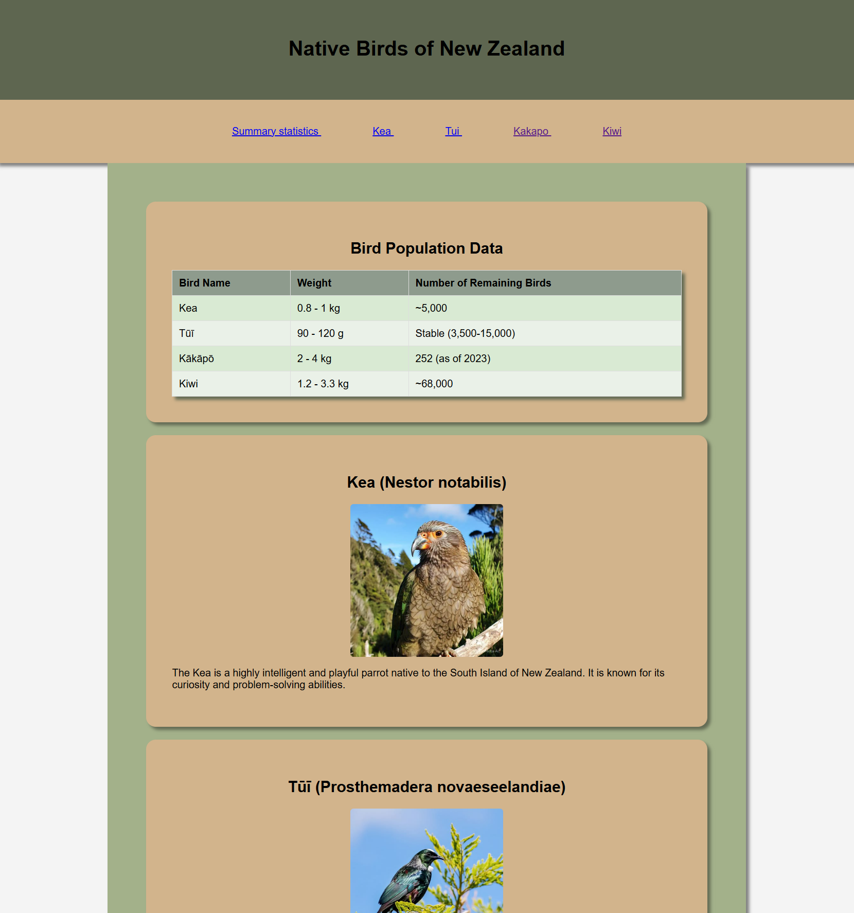
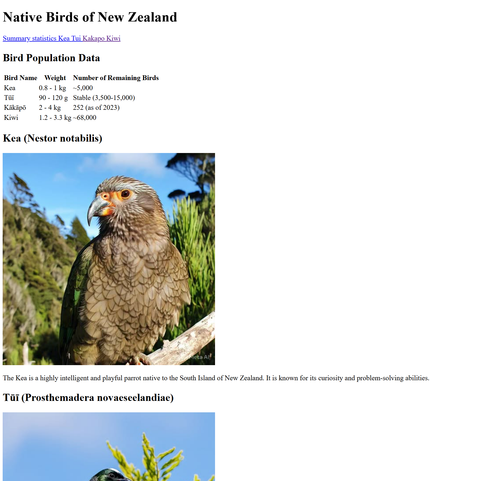
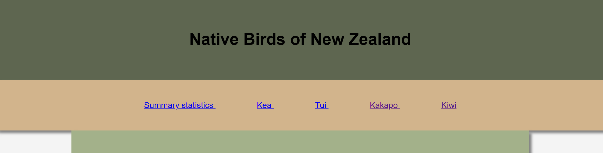

# COMPSCI 719 Test One - New Zealand Birds website

In this practical test, you will complete the HTML and CSS for a website that displays information about Native Birds of New Zealand.

**Important:** Before starting the test, read these instructions _carefully_, have a look through the test files and make sure you understand what is already there.

## General instructions

In this project's `src` folder, you will find one HTML file and one CSS file. You will be completing the test by editing these two files. You will not need to create any new files.

You have been provided with the default text content for the page within the `body` tags of the `birds.html` file as well as some of the default HTML.

To complete the tasks in this assessment, you should only need to add and modify code within the `birds.html` file and the `styles.css` file.

You have a **two hour** time limit for this test. At the end of the test, make sure to `push` your changes to your `main` branch on GitHub. That will serve as your submission. This test is marked out of **60 marks**.

When you have finished all sections of the test, your page will look something like this:

### Allowed resources and restrictions

This test is **open book** - You may use any paper-based resources, and _almost_ any online resources. The exceptions are:

1. No generative AI of any kind is to be used; this includes AI features that may be available within web pages or IDEs. Please ensure that you are only using reference resources and that you are not using any extensions that have AI.
2. No attempting to solicit help from any other person directly (through speaking to others or using chat programs) or indirectly (by posting on forums)
3. No extra devices like tablets or phones should be used during the test; please ensure that you are only using the one main device you are working on

**If you are caught violating these conditions, you will immediately receive 0 marks for the test.** There will be no exceptions to this rule.

You _are_ allowed to use Google search, including on sites like StackOverflow. You are also encouraged to use the [W3Schools](https://www.w3schools.com/) and / or [MDN](https://developer.mozilla.org/en-US/) documentation. You may also use all Canvas resources, lab exercises and example code provided to you.

### Submission instructions

The last commit to your `main` branch at the test deadline will serve as your submission. The invigilators will allow you a brief period of time after the test (no more than 10 minutes) in order to make your final commit, before you leave the room. Commits made after this time will be ignored, as will commits to any branch other than `main`.

**In addition to the above, you must also submit the URL of your GitHub repository for this test to Canvas, before you leave the room.**

## Task One - Adding some HTML (15 marks)

For this task you will edit the `birds.html` file and add HTML tags to the text content within the page.

You will see that the text content for the page has been included within the `body` tags of the `birds.html` file as well as some comments that describe each section of text content.

Please examine the `birds.html` page and comments carefully as well as the screenshots provided if you are unsure of the details in the requirements below.

Here are the general requirements for this task:

- The main title `Native Birds of New Zealand` should be an `h1` element
- The navigation links should achor elements (`a` tags)
- All subtitles for the summary statistics and bird sections should be `h2` elements
- The navigation links should be bookmarks that link to the `h2` elements within the related sections through the use of appropriately named `id` attributes on the `h2` elements
- The table data should be contained within a table with three columns and four rows; the cells in the top row should be `th` elements
  - You will need to create all HTML elements required to structure the table
- The paragraphed text in each bird section should be contained within a `p` element
- You should add an image ( `img` ) element within each of the four bird sections that contains the image of the bird relating to that section
  - The image should be placed in between the `h2` element and the `p` element within each section
  - The image filenames are named based on the name of the bird in the section they are related to; check the `./src/images` folder to find the named image files

Note: your page will also require the use of `div` elements; however, you may create these during the steps of the next task.

When this task is complete, your page should look something like this:

## Task Two - Styling header and nav (15 marks)

For this task, you will add basic CSS to style the `header` and `nav` sections of the page. 

For this task you are able to modify both the `birds.html` file and the `styles.css` files. You will need to create extra `div` elements as needed and add any `class` or `id` attributes to HTML elements in the page. It is suggested that you make separate `div` elements for both the header and navigation sections so that you can style these as separate sections.

For this task you are required to make your own decisions as to the specific CSS properties and values you use to position elements on the page. You can also choose your own color scheme and the colors do NOT need to be exactly the same as the screenshot provided. Your page does not need to look exactly like the screenshot provided; however, it should meet the general criteria specified in the task requirements.

It is suggested that you consider CSS Box Model and especially padding and margin when positioning elements.

Please examine the screenshots provided below if you are unsure of any steps in the requirements.

### Requirements for Task Two:

- The main heading with the text `Native Birds of New Zealand` should be centered and have space at the top and the bottom
- The main heading should be within a section that has a solid background colour that goes to the left, right and top edges of the page
- The navigation links/anchor elements within the navigation section should be centered with some space in between links and some space at the top and bottom of the links
- The navigation links/anchor elements should be within a section that has a solid background colour that goes to the left and right edges of the page
- Choose a color scheme for the background colors of your header and nav sections; you may wish to use a HTML color palette tool online or manually choose the colors; your colors do NOT need to be the same as the screenshot provided

Your page does not need to look exactly like the screenshot; however, it should meet the general requirements listed above.

When complete, the header and nav section should look something like this:

## Task Three - Styling summary table and bird information sections (20 marks)

For this task, you will add basic CSS to style to the summary statistics table and the bird information sections. After you have completed this task, all sections of the page should have basic CSS style properties applied to them. 

For this task you are able to modify both the `birds.html` file and the `styles.css` files. You may create extra `div` elements as needed and add any `class` or `id` attributes to HTML elements in the page. It is suggested that you make separate `div` elements for each individual bird section and the summary statistics table section as well as one main `div` element that will contain the individual sections. 

You will see that each bird section and the summary statistics sections are separate sections with their own background colour that is contained within the main container for all content below the nav section; you should create `div` elements and use `class` and/or `id` attributes to structure these main sections.

For this task you are required to make your own decisions as to the specific CSS properties and values you use to position elements on the page. You can also choose your own color scheme and the colors do NOT need to be exactly the same as the screenshot provided. Your page does not need to look exactly like the screenshot provided; however, it should meet the general criteria specified in the task requirements.

It is suggested that you consider CSS Box Model and especially padding and margin when positioning elements.

Please examine the screenshots provided below if you are unsure of any steps in the requirements; your page does not need to look exactly the same as the screenshot provided as the positioning of elements and colors may be different; however the general requirements should match those described.

### Requirements for Task Three

Make sure to view the screenshot image in order to understand the written requirements listed below; your page should meet the general requirements listed, but it does NOT need to have the same colors and spacing of elements. 

- Requirements for the main container section:

  - The main container section is the section below the nav that contains the summary statistics and the bird sections
  - All content below the nav section should be contained within a main container `div` that has a background colour; there is a comment in the `birds.html` file indicating where the content for the main container section starts
  - The main container `div` should be narrower than the full page width and be centered so that it has some empty space to the left and right as can be seen in the screenshots provided
  - There should be no empty space between the top of the main container `div` and the bottom of the nav section
- Requirements for the summary statistics section and individual bird sections:

  - The summary statistics and bird sections should be contained within their own `div` elements with their own background color that is different to the background color of the main container `div` element
  - The summary statistics and bird sections should have rounded corners and some padding space around the edges of the content so that elements like subheadings, images, tables and paragraphs are not directly touching the left, top, right or bottom edges
  - The summary statistics and bird sections should have a background color that is different to the main container `div` element that they are contained within
  - All subtitles within the bird and summary statistics sections should be centered
  - All images within each bird section should be centered within the section
  - The text in all paragraphs within each bird section should be left-aligned
  - Choose a color scheme for the background colors of your header and nav sections; you may wish to use a HTML color palette tool online or manually choose the colors; your colors do NOT need to be the same as the screenshot provided
- The summary statistics table should be styled to look something like the table in the screenshot provided; you can choose different colors, but the colors for each row should alternate so that odd and even rows have different colors and the header row should have a unique color different to the others

  - **HINT**: You may need to research reference information to find how to make different rows different colors; there are CSS selectors that let you select odd/even child elements or alternatively you could use `class` attributes on row elements to be able to select and apply different styles to each row
- You should add `box-shadow` to the navigation section, the main container section, the summary statistics section, the table and each bird section

  - You may need to use reference information to research the `box-shadow` property in CSS if you have not used this before; MDN or W3Schools has comprehensive reference information on `box-shadow`
  - Observe the screenshots provided carefully to see how `box-shadow` has been used; you do not need to make your `box-shadow` look exactly the same as the screenshots; however, it should look generally similar to the screenshots provided

When this task is complete, your page should look something like this:

## Task Four - Advanced styling: font and hover effect (10 marks)

For this task, you will add some extra more advanced styling to your page. These steps may require some extra research of reference material. 

There are no screenshots for this task as it will appear differently depending on what font you choose.

### Adding non-standard font from Google Fonts

For this step of Task Four, you will add a non-standard font from Google Fonts to your page that has a different appearance to the standard font. 

It is your choice which font you choose; however, it must be added from Google Fonts.

Google Fonts provide several different methods for adding fonts. You may choose any method for adding the font to the page; however, it is suggested that you use a method that you have practised within the lab exercises. 

Make sure to test that your font is added correctly by viewing your page in the web browser and ensuring that it is displaying the font correctly.

### Adding a hover transition to images

Add a hover transition to all images on the page so that when the mouse cursor hovers over an image the image will transition to being 10% larger over 1 second.

Make sure to research how to do this as there are several different methods that you may choose. 

